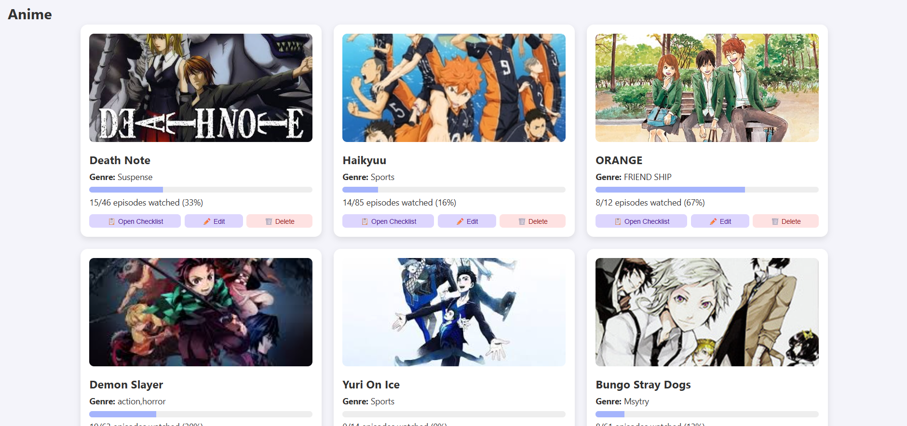
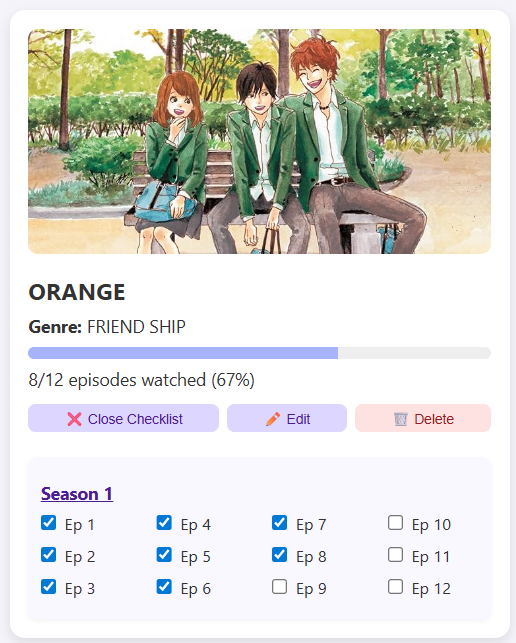

# 🎬 Entertainment Tracker Web App    

Welcome to the **Entertainment Tracker Web App**!  
This is a sleek, cute, and functional app for keeping track of your Anime, Movies, Series, and Books — complete with episode/chapter tracking, beautiful progress bars, and support for multiple sections!

---

## ✨ Features

- ✅ **Add your own Anime, Movies, Series, or Books**
- 📸 Upload custom **thumbnail images**
- ✂️ Styled file upload button with file name preview
- 🔢 Support for **multiple seasons & episodes** or **chapters**
- 📋 **Check off watched episodes/chapters** in clean vertical columns
- 🌈 Gorgeous **progress bars** update in real-time
- 🖼️ Images auto-cropped to fit beautifully in cards
- 🔃 **Edit** and **Delete** items easily
- 💾 All data saved in **local storage** (no server needed!)
- 🔀 Easily **switch between categories** (anime, movies, series, novels)
- 📚 Books tracked with **chapter-only** mode
- 🎨 Fully responsive and designed with love

---

## 🚀 How to Use

1. **Clone or download** this repo  
2. Open `index.html` in your browser  
3. Start tracking your favorite media 🎉

---

## 📁 Folder Structure

📦 media-tracker
├── 📄 index.html
├── 🎨 style.css
├── 🧠 script.js
├── 📁 assets/
│ ├── default.jpg (fallback image)
│ ├── Full_Page.png
│ ├── Anime_list.png
│ └── Checklist_+_Progress_bar.png
└── 📄 README.md

---

## 📸 Screenshots

  
  

---

## 🧠 Technologies Used

- HTML5
- CSS3 (with custom styling & animation)
- JavaScript (pure vanilla JS)
- Local Storage API

---

## 🛠️ Future Improvements

- 📅 Add a **calendar feature** to show when episodes were watched
- 🌐 Support for **multiple languages**
- 🔍 Add **search & filter** functionality
- ☁️ Connect to **Firebase or a database** for cloud sync
- 📝 Option to **add notes per episode/chapter**
- 🕶️ **Dark mode** toggle
- 🧩 Drag-and-drop reordering
- 🎉 Confetti animation when completing a series or book

---

## 💖 Credits

Made with love by [Ishani Murkewar](https://www.linkedin.com/in/ishani-murkewar-ab9063317/)  
> Inspired by the joy of tracking stories we adore 📚🎥🎴

---

## 📜 License

This project is open-source and free to use for personal & educational purposes.
